# Cheonan Smart Parking

> **2026 CO-MAKER 리빙랩 시민 연구원 참여 프로젝트**로, 천안시 공영주차장 이용 경험을 시민 관점에서 분석하고 개선하기 위해 제작했습니다.

<p align="center">
  <strong>정보, 결제, 혜택이 끊기지 않는 천안형 포용 스마트 주차 UX 서비스</strong>
</p>

<p align="center">
  
  
  
  
  
</p>

<p align="center">
  <a href="#프로젝트-소개">프로젝트 소개</a>
  ·
  <a href="#시연-화면">시연 화면</a>
  ·
  <a href="#기술-스택">기술 스택</a>
  ·
  <a href="#서비스-컨셉">서비스 컨셉</a>
  ·
  <a href="#핵심-기능">핵심 기능</a>
  ·
  <a href="#실행-방법">실행 방법</a>
</p>

---

## 프로젝트 소개

**천안 공영주차장의 정보, 결제, 혜택 단절을 연결해 시민과 방문객 모두가 끊김 없이 이용할 수 있는 포용형 스마트 주차 서비스입니다.**

이 프로젝트는 단순한 주차 앱이 아니라, 스마트도시 인프라가 시민의 실제 이동 경험과 만나는 지점을 설계하는 UX 프로토타입입니다.

---

## 시연 화면

실제 시연 이미지나 사진은 **프로젝트 소개 바로 아래**에 두는 것이 가장 좋습니다. GitHub 방문자는 글보다 화면을 먼저 보기 때문에, 서비스 가치가 가장 빨리 전달됩니다.

추천 구성은 아래 순서입니다.

| 위치 | 넣으면 좋은 이미지 |
|---|---|
| 첫 번째 | 지도 첫 화면: 주차 가능 마커와 검색/필터가 보이는 화면 |
| 두 번째 | 층별 주차면 화면: 일반, 장애인, 여성전용, 전기차, 임산부 자리가 구분되는 화면 |
| 세 번째 | 주차 위치 저장 모달: 특수 주차면 안내 문구가 보이는 화면 |
| 네 번째 | 결제/혜택 화면: QR 할인, 자동결제, 30분 출차 타이머가 보이는 화면 |

이미지를 추가한다면 `docs/images/` 폴더를 만들고 아래처럼 배치하는 것을 추천합니다.

```txt
docs/images/
├─ 01-map-discovery.png
├─ 02-floor-guide.png
├─ 03-save-position-modal.png
└─ 04-payment-benefit.png
```

이미지를 넣은 뒤 README에는 아래 형식으로 연결하면 됩니다.

```md

```

---

## 기술 스택

| 구분 | 사용 기술 |
|---|---|
| Frontend | React 19, Vite 6, TypeScript, Tailwind CSS 4 |
| Interaction | Motion, React Zoom Pan Pinch |
| Icons | Lucide React |
| Backend | Node.js, Express, TypeScript |
| Docs | Markdown |

---

## 서비스 컨셉

**천안시 스마트 주차 UX**는 천안 공영주차장의 세 가지 단절을 하나의 흐름으로 연결하는 서비스 프로토타입입니다.

| 단절 지점 | 사용자 문제 | 서비스 해결 |
|---|---|---|
| 정보 단절 | 출발 전 빈자리와 도착 후 주차 위치를 알기 어렵다 | 실시간 지도, 주차장 검색, 층별 주차면 안내 |
| 결제 단절 | 정산기 앞에서 조작이 복잡하고 출차 대기가 불편하다 | 하이패스형 자동결제, 주차 시간/요금 확인, 30분 출차 유예 |
| 혜택 단절 | 지역화폐, 감면, 여행지원 혜택이 주차 경험과 이어지지 않는다 | 지역화폐 연동, QR 여행지원 할인, 소식/행사 연계 |

---

## 핵심 기능

### 1. 이용 전: 지도 기반 주차장 탐색

- 천안시 주차장을 지도 마커로 표시
- 주차 가능 대수, 만차 여부, 거리, 요금, 할인 정보 확인
- `빈자리 있는 주차장` 필터로 빈자리 보유 주차장만 정렬
- 공영, 사설, 전기차, 장애인, 여성전용, 임산부 기준 필터 제공

### 2. 이용 중: 층별 주차면 안내

- 층별 주차면 그리드 제공
- 일반, 장애인, 여성전용, 전기차, 임산부 주차면을 색상과 라벨로 구분
- 추천 기준에 맞는 가장 가까운 자리 찾기
- 특수 주차면 선택 시 이용 조건 안내 모달 제공
- 내 차 위치 저장 후 주차 세션 시작

### 3. 이용 후: 자동결제와 혜택 연결

- 현재 주차 시간, 예상 요금, 할인 금액 확인
- 하이패스형 자동결제 등록/상태 표시
- QR 여행지원 할인 적용
- 결제 완료 후 30분 출차 유예 타이머 제공
- 이용내역, 결제내역, 영수증 흐름 제공

### 4. 지역 연계: 천안 소식

- 천안 행사, 공지, 지원 사업 더미 데이터 제공
- 소식 카드 클릭 시 상세 모달 표시
- 대상 장소, 연계 혜택, 후속 행동 버튼 제공

---

## UI/UX 포인트

| 영역 | 설계 방향 |
|---|---|
| 접근성 | 고령자도 읽기 쉬운 큰 글자, 명확한 버튼 문구, 글자 크기 설정 |
| 반응형 | 모바일 중심 레이아웃, 하단 탭, 바텀시트, 모달 대응 |
| 인터랙션 | 모든 활성 버튼 hover 피드백, 비활성 버튼 구분, 배경 클릭 닫기 |
| 정보 위계 | 지도 → 주차장 카드 → 층별 지도 → 내 차 위치 → 결제 흐름 |
| 공공 서비스 톤 | 과도한 장식보다 명확한 상태, 요금, 혜택, 안내 중심 |

---

## 프로젝트 구조

```txt
cheonan-smart-parking/
├─ frontend/             # React + Vite + Tailwind 기반 사용자 앱
│  ├─ src/
│  │  ├─ App.tsx         # 주요 화면, 상태, 인터랙션
│  │  ├─ constants.ts    # 더미 주차장, 결제, 차량 데이터
│  │  ├─ types.ts        # TypeScript 타입 정의
│  │  └─ index.css       # 전역 스타일, 반응형/hover 스타일
│  └─ package.json
├─ backend/              # Express 기반 API 서버 골격
│  ├─ src/server.ts
│  └─ package.json
├─ docs/                 # 기획/기능/디자인 문서
│  ├─ smart-parking-functional-spec.md
│  └─ designer-review-checklist.md
└─ README.md
```

---

## MVP 시연 흐름

```mermaid
flowchart LR
  A["지도 탐색<br/>주차 가능 대수 확인"] --> B["주차장 카드<br/>요금·할인·거리 확인"]
  B --> C["층별 주차면<br/>특수면/일반면 구분"]
  C --> D["추천 기준 선택<br/>일반·전기차·장애인·여성전용"]
  D --> E["가장 가까운 자리<br/>조건에 맞는 빈자리 추천"]
  E --> F["주차 위치 저장<br/>내 차 세션 시작"]
  F --> G["요금 확인<br/>주차 시간·할인 금액 표시"]
  G --> H["QR 혜택 적용<br/>여행지원 할인 반영"]
  H --> I["자동결제 완료<br/>정산기 없이 출차"]
  I --> J["30분 출차 타이머<br/>추가 요금 불안 해소"]
  J --> K["천안 소식 상세<br/>행사·혜택·주차 정보 연결"]

  classDef before fill:#EFF6FF,stroke:#3B82F6,color:#172554,stroke-width:1px;
  classDef during fill:#F0FDF4,stroke:#22C55E,color:#14532D,stroke-width:1px;
  classDef after fill:#FFF7ED,stroke:#F97316,color:#7C2D12,stroke-width:1px;
  classDef local fill:#F5F3FF,stroke:#8B5CF6,color:#3B0764,stroke-width:1px;

  class A,B before;
  class C,D,E,F during;
  class G,H,I,J after;
  class K local;
```



| 단계 | 시연 포인트 |
|---|---|
| 이용 전 | 지도에서 주차 가능한 곳을 찾고, 카드에서 요금과 할인 정보를 확인 |
| 이용 중 | 층별 지도에서 내 조건에 맞는 가장 가까운 빈자리를 추천받고 위치 저장 |
| 이용 후 | 할인 적용, 자동결제, 30분 출차 타이머로 정산기 없는 출차 경험 제시 |
| 지역 연결 | 천안 소식을 통해 행사, 혜택, 주차 수요 정보를 서비스 안에서 연결 |

---

## 실행 방법

### 프론트엔드 실행

```bash
cd frontend
npm install
npm run dev
```

기본 주소:

```txt
http://localhost:3000
```

### 백엔드 실행

```bash
cd backend
npm install
npm run dev
```

### 루트에서 실행

```bash
npm run dev:frontend
npm run dev:backend
```

### 빌드 확인

```bash
npm run build
```
